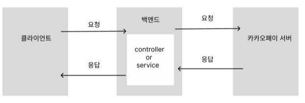
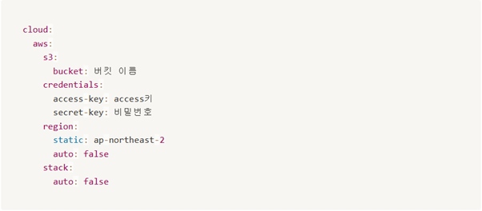

## [카카오페이 API]
 

### - 적용 이유

스터디 보증금 제도를 도입하기 위해, 외부 api인 카카오페이 api를 활용하였습니다.

 

### - 설정 방법

카카오페이 api는 kakao developers 페이지에서 사이트 도메인을 설정해야 합니다.

 

 

### - 적용 방법

 

 

카카오페이는 cors를 막아 놓았기 때문에, 동일 서버가 아닐 경우 cors 에러가 발생할 수 있습니다. 
그렇기에 클라이언트가 아닌 서버에서 restTemplate를 활용하여 cors를 우회하여 요청을 보냈습니다.  
실제로 가맹점이 있는 서비스가 아니기에 카카오페이에서 제공하는 test가맹점 코드를 받고, 서버에서 결제 요청 상세 정보를 카카오페이 서버에 전달합니다.  
그리고 카카오페이 서버에서 사용자를 인증한 후, 사용자에게 입력받은 결제 승인 상세 정보를 카카오페이 서버에 전달합니다.  
마지막으로 카카오페이 서버에서 최종 결제 처리를 완료합니다.

 

## [AWS – S3] 
### - 적용 이유
이미지, 파일 등의 자료를 관리하기 위해 AWS에서 제공하는 인터넷 스토리지 서비스인 S3를 사용하여 파일 서버로 활용하였습니다.
### - 설정 방법

 
aws와 서버를 연결하기 위해 application.yml에 s3에서 생성한 키와 비밀번호를 설정합니다. 

### - 적용 방법

AWS의 버킷을 생성한 후, 버킷의 사용자를 설정합니다. 액세스 키와 비밀키를 생성한 후, 키를 활용하여 버킷의 정책을 변경합니다. 서버에 s3와 관련된 의존성을 부여하고, Bean으로 주입합니다. 그 후 이미지와 파일 업로드, 다운로드 기능을 구현할 코드를 작성합니다.
